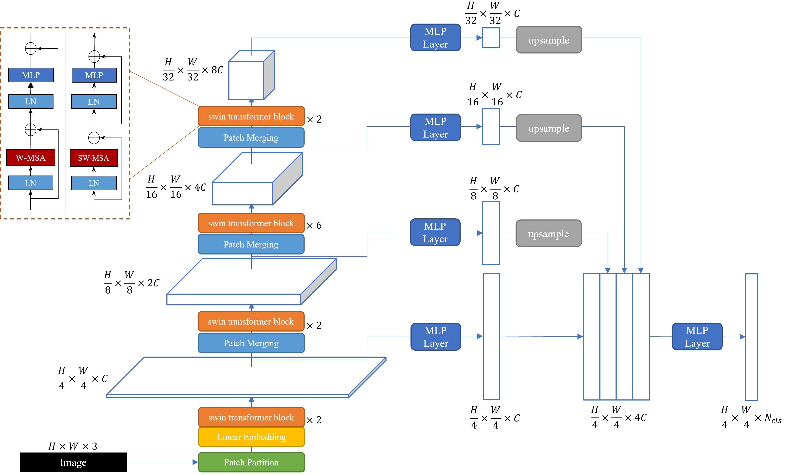

# SSformer

SSformer is A Lightweight Transformer for Semantic Segmentation.

<div align=center></div>

We use [MMSegmentation v0.24.1](https://github.com/open-mmlab/mmsegmentation/tree/v0.24.1) as the codebase.

## Installation

For install , please refer to the guidelines in [MMSegmentation v0.24.1](https://github.com/open-mmlab/mmsegmentation/blob/v0.24.1/docs/en/get_started.md#installation).

An example (works for me): ```CUDA 11.3``` and  ```pytorch 1.10.0``` 
### A from-scratch setup script

#### Linux

Here is a full script for setting up SSformer with conda and link the dataset path (supposing that your dataset path is $DATA_ROOT).

```shell
conda create -n open-mmlab python=3.10 -y
conda activate open-mmlab
conda install pytorch=1.11.0 torchvision cudatoolkit=11.3 -c pytorch
pip install mmcv-full -f https://download.openmmlab.com/mmcv/dist/cu113/torch1.11.0/index.html
git clone https://github.com/shiwt03/SSformer.git
cd SSformer
pip install -e .  # or "python setup.py develop"
mkdir data
ln -s $DATA_ROOT data
```

#### Windows(Experimental)

Here is a full script for setting up mmsegmentation with conda and link the dataset path (supposing that your dataset path is
%DATA_ROOT%. Notice: It must be an absolute path).

```shell
conda create -n open-mmlab python=3.10 -y
conda activate open-mmlab
conda install pytorch=1.11.0 torchvision cudatoolkit=11.3 -c pytorch
set PATH=full\path\to\your\cpp\compiler;%PATH%
pip install mmcv
git clone https://github.com/open-mmlab/mmsegmentation.git
cd mmsegmentation
pip install -e .  # or "python setup.py develop"
mklink /D data %DATA_ROOT%
```

## Dataset Preparation

For dataset preparation, please refer to the guidelines in this [link](https://github.com/open-mmlab/mmsegmentation/blob/v0.24.1/docs/en/dataset_prepare.md#prepare-datasets).

It is recommended to symlink the dataset root to `SSformer/data`.
If your folder structure is different, you may need to change the corresponding paths in config files.

The fold structure is recommended to be:
```none
mmsegmentation
├── data
│   ├── cityscapes
│   │   ├── leftImg8bit
│   │   │   ├── train
│   │   │   ├── val
│   │   ├── gtFine
│   │   │   ├── train
│   │   │   ├── val
│   ├── ade
│   │   ├── ADEChallengeData2016
│   │   │   ├── annotations
│   │   │   │   ├── training
│   │   │   │   ├── validation
│   │   │   ├── images
│   │   │   │   ├── training
│   │   │   │   ├── validation
```

### Cityscapes

The data could be found [here](https://www.cityscapes-dataset.com/downloads/) after registration.

By convention, `**labelTrainIds.png` are used for cityscapes training.
MMsegmentation provided a [scripts](https://github.com/open-mmlab/mmsegmentation/blob/master/tools/convert_datasets/cityscapes.py) based on [cityscapesscripts](https://github.com/mcordts/cityscapesScripts)
to generate `**labelTrainIds.png`.

```python
# --nproc means 8 process for conversion, which could be omitted as well.
python tools/convert_datasets/cityscapes.py data/cityscapes --nproc 8
```

### ADE20K

The training and validation set of ADE20K could be download from this [link](http://data.csail.mit.edu/places/ADEchallenge/ADEChallengeData2016.zip).
We may also download test set from [here](http://data.csail.mit.edu/places/ADEchallenge/release_test.zip).

## Evaluation

Download [trained weights]().

### ADE20K

Example: evaluate ```SSformer``` on ```ADE20K```:
```python
# Single-gpu testing
python tools/test.py configs/SSformer/SSformer_swin_512x512_160k_ADE20K.py /path/to/checkpoint_file
```

### Cityscapes

Example: evaluate ```SSformer``` on ```Cityscapes```:
```python
# Single-gpu testing
python tools/test.py configs/SSformer/SSformer_swin_1024x1024_160k_Cityscapes.py /path/to/checkpoint_file
```

## Training
Download [weights]() pretrained on ImageNet-22K, and put them in a folder ```pretrained/```.
Example: train ```SSFormer``` on ```ADE20K```:
```python
# Single-gpu training
python tools/train.py configs/SSformer/SSformer_swin_512x512_160k_ADE20K.py
```
## Visualize
Here is a demo script to test a single image. More details refer to [MMSegmentation's Doc](https://mmsegmentation.readthedocs.io/en/latest/get_started.html).
```shell
python demo/image_demo.py ${IMAGE_FILE} ${CONFIG_FILE} ${CHECKPOINT_FILE} [--device ${DEVICE_NAME}] [--palette-thr ${PALETTE}]
```

Example: visualize ```SSformer``` on ```CityScapes```: 

```shell
python demo/image_demo.py demo/demo.png configs/SSformer/SSformer_swin_512x512_160k_ADE20K.py \
/path/to/checkpoint_file --device cuda:0 --palette cityscapes
```

## License
Please check the LICENSE file. 